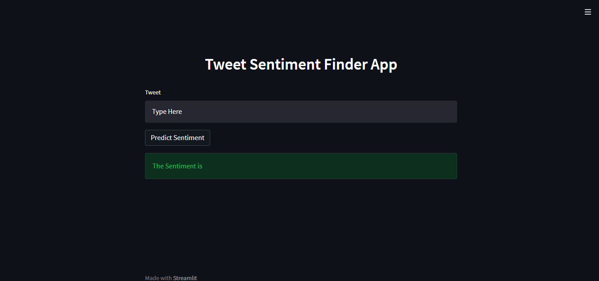

# Corona Virus Tweet Sentiment Classification

## Table of Content
* [Overview](#overview)
* [Demo](#demo)
* [Steps to Reproduce](#steps-to-reproduce)
* [Technologies Used](#technologies-used)
* [Further Improvements](#further-improvements)

### Introduction

This is an end-to-end <b>Machine Learning</b>web application deployed using <b>Streamlit</b> that classifies the tweet into 3 classes viz. <b>Neutral</b>, <b>Positive</b>, <b>Negative</b>. 

The dataset has been taken from Kaggle([link](https://www.kaggle.com/datatattle/covid-19-nlp-text-classification)).

<b>Implementation of NLP pipeline</b>:
- EDA
- Data Cleaning
- Data Preprocessing
- Modelling- Used SepCNN model
- Deployment- Use Streamlit

The jupyter notebooks of Data Exploration, preprocessing and modelling can be found in [notebooks](https://github.com/shikhargoswami/tweet_sentiment_analysis/tree/main/notebooks) folder.

### About the model

The model is configurable for both binary as well as multi-class settings. THe configurations can be changed in config.py file. I have tried to modularize the code and separate out all the steps in the pipeline. train.py calls all the other modules.

### Steps to Reproduce

- Clone the repositry
- Create a python virtual environment
- `pip3 install -r requirements.txt`
- `streamlit run app.py`

You will be redirected to the webpage as shown:

- Write the tweet and click Predict button

You can also train the model by:

- `python3 train.py --epochs 10`

### Technologies Used
- Tensorflow
- Streamlit
- Scikit-Learn
- Pandas

### Further Improvements

- <b>Train for more epochs</b>: Due to time constraints, I trained it only for 10 epochs. The precision and recall are greater than .90 percent however validation loss= 0.58
- <b>Use Pre-trained Embeddings</b>: I trained the embeddings from scratch. However to increase the accuracy, pre-trained BERT embeddings can be used.
- <b>Handle Class Imbalance Problem</b>: Weirdly, Neutral class instances are very low and the model is predicting this class most of the times. Further improvements are required.